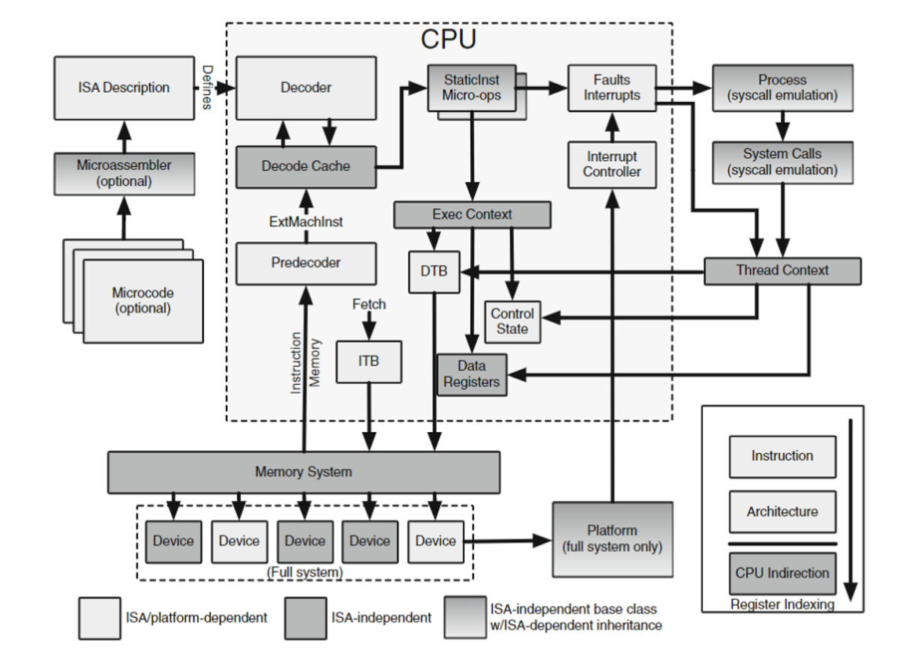
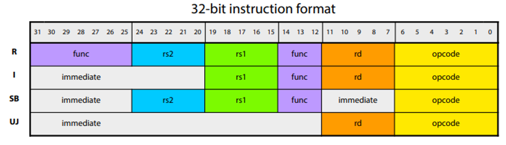

<!-- _class: title -->

## Modeling Cores in gem5

---

## What is an ISA?

The _Instuction Set Architecture_ (ISA) is the interface between the software and the hardware.

Components of an ISA:
* Instructions that a processesor can exectue
* Registers that are available
* Memory model
* Exception and interrupt handling


### ISA's gem5 supports

- ARM
- RISC-V
- x86
- MIPS
- SPARC

Realistically you'll only really care about ARM, RISC-V, and x86.
---

## ISA-CPU Independence

Unlike in real hardware, where the CPU is tightly coupled to the ISA, gem5 can aid in the development of new ISAs and CPU models but decoupling the two.
In doing so gem5 CPU models become ISA aignostic (or ISAs become CPU model agnostic).

While there are limits to this independence, the goal is to allow for the easy addition and of new ISAs and CPU models without dealing with massive code changes.
As a high level summary, this independence is achieved by having a seperate decoder for each ISA, which is convert instructions to objects desribing their behavior.
These objects are instantiations of classes common to all ISAs and the CPU models.
The CPU model can execute them.
The CPU model simply "plugs-in" the decoder it needs for the ISA it is running.

For example, an Out-of-order CPU model can execute an `ADD` instruction from a RISC-V ISA and an `ADD` instruction from an ARM ISA.
The Out-of-order CPU model doesn't care about the ISA as both instructions are cast to the same class with the same API. The CPU models and own internal logic regarding the execution of instructions (in this case, incoprorate out-of-order execution) continues and the specific behavior of the instructions themselves is handled seperately.

---

### ISA-CPU Independence Diagram



---

## StaticInst and DynamicInst

An ISA instruction is converted into two object in gem5, used to model the instruction in the CPU model.
While the `DynamicInst` object is derived from the `StaticInst` they can both be seen as products of decoding an instruction.

### StaticInst

A `StaticInst` is an object containing static information about a particular ISA instruction for all instances of that instruciton.

It contains information on

- The operation class
- Source and destination registers
- Flags to show if the instruction has micro-ops
- Functions defining the instruction's behavior
  - `execute()`
  - `initiateAcc()`
  - `completeAcc()`
  - `dissasemble()`

`StaticInst` objects are used by the CPU model to understand how an ISA instruction is to be modeled in gem5.

---

### DynamicInst

`DynamicInst` objects contains the information that is specific to a particular instance of an instruction.
They are derived from `StaticInst` objects

They contains information on:

- PC and predicated next-PC
- Instruction result
- Thread number
- CPU
- Renamed register indeices
- Provides the `ExecContext` interface

#### ExecContext

The `ExecContext` interface provides the Dynamic instruction an ingerface to query the CPU model for information.
The purpose of this interface is to allow for more complex CPU models which require more information than what is provided by the `StaticInst` object and this dynamic infrom is required for the instruction behavior to work.
For example, the instruction may be mapped to a different physical register than the one specified in the instruction.

---
### Summary: `StaticInst` and `DynamicInst`/`ExecContext`

You can think of this at a high level:

- `StaticInst`: Static, used by the CPU to understand the instruction.
- `DynamicInst`: Dynamic, used by the Instruction to access the CPU via the `ExecContext` interface.

---

## Journey of an Instruction in gem5

In this example we will use GDB to trace the execution of an instruction in gem5.

To start we will run the script in [materials/03-Developing-gem5-models/05-modeling-cores/01-inst-trace.py](../../materials/03-Developing-gem5-models/05-modeling-cores/01-inst-trace.py) via GDB.

Using GDB we will add breakpoints to the `Add::Add` and `Add::execute` functions.

```shell
gdb gem5

# Add breakpoints to for functions in StaticInst object representing the `Add`
# instruction.

# Add breakpoints to the `Add::Add` function.
# This is just the constructor for the `Add` class. It created the `StaticInst`
# object that represents the `Add` instruction.
(gdb) b Add::Add

# Add breakpoints to the `Add::execute` funciton.
# This is function called to execute the `Add` instruction.
(gdb) b Add::execute

# Start execution of gem5
(gdb) run \
    materials/03-Developing-gem5-models/05-modeling-cores/01-inst-trace.py
```

---

### RISC-V `Add::Add` Backtrace

You should have reached the first breakpoint in the `Add::Add` function:

```shell
Breakpoint 1, 0x0000555555a3b1b0 in gem5::RiscvISAInst::Add::Add(unsigned int) ()
```

Next we'll do a backtrace. A backtrace shows the functions that have been called to reach the current function.
Let's see the last 10 functions that have been called:

```shell
(gdb) bt 10
```

---

Output:

```shell
0 {PC} in gem5:: RiscvISAInst::Add: :Add(unsigned int) ()
1 {PC} in gem5:: RiscvISA:: Decoder: :decodeInst(unsigned long) ()
2 {PC} in gems:: RiscvISA: :Decoder: : decode(unsigned long, unsigned long)
3 {PC} in gem5:: RiscvISA: :Decoder:: decode (gem5:: PCStateBase&) ()
4 {PC} in gem5:: BaseSimpleCPU:: preExecute ()
5 {PC} in gem5:: TimingSimpleCPU:: IcachePort:: ITickEvent:: process () ()
6 {PC} in gem5:: EventQueue:: serviceone() ()
7 {PC] in gem5: :doSimLoop (gem5:: EventQueue*) ()
8 {PC} in gem5:: simulate(unsigned long) ()
9 {PC} in pybind11::pp_function:: initialize<gem5: :GlobalSimLoopExitEve ...
```

Here the 0th function call is the `Add::Add` function.
and each subsequent index is the function that called the previous (i.e., the 1st function called the 0th function, the 2nd function called the 1st function, etc.)

The 5th function is the `TimingSimpleCPU` model's `process` function, the function used to process an instruction.
The functions at indexes > 6 are gem5's internal functions called prior to the instruction execution which we needn't concern ourselves with here.

---

```shell
4 {PC} in gem5:: BaseSimpleCPU:: preExecute ()
```

This is a function called before the instruction is executed. It is used to perform any necessary setup.
In the case of `TimingSimpleCPU`, this function is used to perform translation of the bytes received to the instruction object.

You can go to ["src/cpu/simple/base.cc"](https://github.com/gem5/gem5/blob/v24.0/src/cpu/simple/base.cc#L328) in the gem5 repo to see the `BaseSimpleCPU`'s `preExecute` function.

---

The next function in the backtrace is the RISC-V ISA's decoder.

```shell
3 {PC} in gem5:: RiscvISA: :Decoder:: decode (gem5:: PCStateBase&) ()
```

This function is called from the following line in the `BaseSimpleCPU`'s `preExecute` function:

```cpp
        //Decode an instruction if one is ready. Otherwise, we'll have to
        //fetch beyond the MachInst at the current pc.
        instPtr = decoder->decode(pc_state);
```

You can follow this call through to `Decoder:: decode` which can be found in [src/arch/riscv/decoder.cc](https://github.com/gem5/gem5/blob/v24.0/src/arch/riscv/decoder.cc#110) in the gem5 repository

---

```cpp
StaticInstPtr
Decoder::decode(PCStateBase &_next_pc)
{
    if (!instDone)
        return nullptr;
    instDone = false;

    auto &next_pc = _next_pc.as<PCState>();

    if (compressed(emi)) {
        next_pc.npc(next_pc.instAddr() + sizeof(machInst) / 2);
        next_pc.compressed(true);
    } else {
        next_pc.npc(next_pc.instAddr() + sizeof(machInst));
        next_pc.compressed(false);
    }

    emi.vl      = next_pc.vl();
    emi.vtype8  = next_pc.vtype() & 0xff;
    emi.vill    = next_pc.vtype().vill;
    emi.rv_type = static_cast<int>(next_pc.rvType());

    return decode(emi, next_pc.instAddr());
}
```

This function loads the next instruction into the decoder before calling calling [`Decoder::decode(ExtMachInst mach_inst, Addr addr)`](https://github.com/gem5/gem5/blob/v24.0/src/arch/riscv/decoder.cc#93).

---

```cpp
StaticInstPtr
Decoder::decode(ExtMachInst mach_inst, Addr addr)
{
    DPRINTF(Decode, "Decoding instruction 0x%08x at address %#x\n",
            mach_inst.instBits, addr);

    StaticInstPtr &si = instMap[mach_inst];
    if (!si)
        si = decodeInst(mach_inst);

    si->size(compressed(mach_inst) ? 2 : 4);

    DPRINTF(Decode, "Decode: Decoded %s instruction: %#x\n",
            si->getName(), mach_inst);
    return si;
}
```

This functionmostly serves as a simple wrapper to call the `Decoder::decodeInst` function plus setting the size and allowing for some debug information.

The `decodeInst` function is the next function on the backtrace but... it's generated...


---

The `decideInst` function is generated code and will only be available to you if you build gemt (`scons build/ALL/gem5.opt -j$(nproc)`).
A copy of these generated files has been added for your reference in [materials/03-Developing-gem5-models/05-modeling-cores/build-riscv-generated-files](../../materials/03-Developing-gem5-models/05-modeling-cores/build-riscv-generated-files/).

Here is a snippet of "decode-method.cc.inc", removing supurflous lines, to show the path to the statement returning `Add` instruction:

```cpp
// ...
case 0xc:
    switch (FUNCT3) {
    case 0x0:
        switch (KFUNCT5) {
        case 0x0:
            switch (BS) {
            case 0x0:
                // ROp::add(['\n                            Rd = rvSext(Rs1_sd + Rs2_sd);\n                        '],{})
                    return new Add(machInst);
                break;
```

This decode function takes the machine instruction and returns the appropriate `StaticInst` object (`Add(machInst)`).
It is just a giant map.

---

### RISC-V `Add::Execute` Backtrace

Let's continue  in GDB to reach the next breakpoint:

```shell
(gdb) c
```

If successful you should see the following output:

```shell
Breakpoint 2, {PC} in gem5:: RiscvISAInst::Add::execute...
```

Next, we'll do a backtrace to see the functions that have been called to reach the current function:

```shell
(gdb) bt 5
```

As you can see, the execute function is called via the `TimingSimpleCPU` model's `process` function.

---

The following code can be found in ["src/cpu/simple/timing.cc](https://github.com/gem5/gem5/blob/v24.0/src/cpu/simple/timing.cc):

```cpp
void
TimingSimpleCPU::IcachePort::ITickEvent::process()
{
    cpu->completeIfetch(pkt);
}
```

Then follows through to:

```cpp
// non-memory instruction: execute completely now
        Fault fault = curStaticInst->execute(&t_info, traceData);
```


TODO: I dont know what to do here, i can't make any real sense of where this goes and what it does.


---

## The gem5 ISA Parser

So far we've seen, how an instruction is decoded then executed in gem5.
However, we haven't seen how this decoding process is defined and the behavior of the instrucion's execution is defined.
This is where it gets complicated...

### ISA Specification and Parsing

The "src/arch/*/isa directory contains the ISA definition.
This is written in bespoke language we refer to as the ISA Domain Specific Language (ISA DSL)

When gem5 is built the build system parses these files using the ["src/arch/isa/isa_parser/isa_parser.py"](https://github.com/gem5/gem5/blob/v24.0/src/arch/isa/isa_parser/isa_parser.py) script which generates  the necessary CPP code.
These generated files can be found in "build/ALL/arch/*/generated/".
The gem5 build system then compiles thes generated files into the gem5 binary.


### Let's focus on one RISC-V instruction

In the following we are going to look at the `LW` instruction in the RISC-V and how it is specified, decoded, and executed in gem5.

#### The RISC-V instruction formats

To understand the RISC-V ISA, and how the gem5 RISC-V decoder works, we need to understand the base instruction formats.
The base instruction formats are the R, I, S, B, U, and J types which use thye following formats:



- R type: for register-register operations.
- I type: for immediate and load operations.
- S type: for store operations.
- B type: for branch operations.
- U type: for upper immediate operations.
- J type: for jump operations.

---

#### RISC-V's "Load word" (LW) instruction

Load Word (instruction: `LW`) is an I-type instruction which loads a 32-bit value from memory into a register.
It is defined by the folowing format:

```shell
LW rd,offset(rs1) # rd = mem[rs1+imm]
```

- `lw` is the mnemonic for the instruction.
- `rd` is the destination register.
- `imm` immediate value: termines the offset (can be used to access sub-word data).
- `rs1` is the source register.

It loads the value of source register  `rs1` into the destination register `rd + imm`.
If `imm` is zero, the full word (32-bits) of `rs1` is loaded into `rd`.
This `imm` value is used to load subword data.
However, if non-zero, `imm` is used to load subword data. `imm` shifts the bits in the `rs1` register prior to loading to `rd`.
So, if `imm = 15`, the value of `rs1` is shifted by 15 bits before being loaded into `rd`.

---

#### RISC-V's LW Instruction Breakdown

Consider the following instruction:

```txt
000000000000000000000000100100110001100011
```

It's a LW instruction, which is an I-type instruction.
The instruction is therefore broken down as follows:


```txt
|   31  --  20   |  19 -- 15  |  14 -- 12  |  11 -- 7  |  6 -- 0 |
|  000000000001  |    00010   |    010     |   00011   |  000011 |
|       imm      |     rs1    |   func3    |    rd     |  opcode |
```

In this example  register with address 2 (`rs1`) is loaded into register with address 3 (`rd`) with an offset of 1 (`imm`).
`funct3` is the function code for the LW instruction (this is always 010 for the LW instruction).
`opcode` is the operation code for the LW instruction (also always the same).

**Note**: In gem5 we additionally refer to `QUANDRANT` or `QUAD` which is the last two bits of the opcode (`11` in this case), and `OPCODE5` which refers to the `opcod`e bit shift right by 2 (basically `opcode` without `QUAD`, `0000` in this case).
Ergo `opcode` = (`OPCODE5` << 2 )+ `QUAD`.

---

#### Understanding the decoding of LW

What the ISA definition does is define how the instruction is decoded is broken down and how the "parts" (bitfields) of the instruction are used to decode the instruction.

Go to the "src/arch/riscv/isa/bitfields.hsh directory"  n the gem5 repository.

```txt
// Bitfield definitions.
//
def bitfield RVTYPE rv_type;

def bitfield QUADRANT <1:0>;
def bitfield OPCODE5 <6:2>;

// R-Type
def bitfield ALL    <31:0>;
def bitfield RD     <11:7>;
..
```

This defines the bitfields, like those decribed on the previous slide.
THe decoder uses these bitfirelds to decode the instruction.

---

Go to "decoder.isa" and search for the `lw` instruction

The following shows the path to the instruction definition via parsing of the instruction's `opcode` and `funct3` fields:

```txt
# A reduced decoder.isa to focus just on the path to `lw`.
decode QUADRANT default Unknown::unknown() {
    0x3: decode OPCODE5 { # if QUADRANT == 0x03; then decode OPCODE5
        0x00: decode FUNCT3 { # if OPCODE5 == 0x00; then decode FUNCT3
            format Load { # This tells use to use the `Load` format whewn decoding (more on this later)
                0x2: lw({{ # if QU # if FUNCT3 == 0x02 then declare lw instruction
                    Rd_sd = Mem_sw;
                }});
            }
        }
    }
}
```

`Rd_sd` is the destination register, and `Mem_sw` is the memory address to be loaded into the destination register.
The code bewtwween the `{{` and `}}` is CPP code that is executed when the instruction is executed.

---

### Generating code from the LW ISA definition

You can compare side by side decoder.isa and decode-method.cc.inc to see how the ISA definition is used to generate the decoder code.

```txt
decode QUADRANT default Unknown::unknown() {
```

becomes

```cpp
using namespace gem5;
StaticInstPtr
RiscvISA::Decoder::decodeInst(RiscvISA::ExtMachInst machInst)
{
    using namespace RiscvISAInst;
  switch (QUADRANT) {
```

---

```txt
0x3: decode OPCODE5 {
```

becomes

```cpp
case 0x3:
      switch (OPCODE5) {
```


---

```txt
0x00: decode FUNCT3 {
```

becomes

```cpp
case 0x00:
    switch (FUNCT3) {
```

---

Finally,

```txt
format Load {
    0x2: lw({{ # if QU # if FUNCT3 == 0x02 then declare lw instruction
        Rd_sd = Mem_sw;
    }});
}
```

becomes

```cpp
case 0x2:
    // Load::lw(['\n                    Rd_sd = Mem_sw;\n                '],{})
    return new Lw(machInst);
    break;
```

---

The compelte translation is :

```cpp
using namespace gem5;
StaticInstPtr
RiscvISA::Decoder::decodeInst(RiscvISA::ExtMachInst machInst)
{
    using namespace RiscvISAInst;
    switch (QUADRANT) {
        case 0x3:
            switch (OPCODE5) {
                case 0x0:
                    switch(FUNCT3) {
                        case 0x2:
                            // Load::lw(['Rd_sd = Mem_sw;'],{})
                            return new Lw(machInst);
                            break;
                    }
            }
    }
}
```

---

### The generated function to execute the LW instruction

Go to the "decoder-ns.cc.inc" file and search for "LW".

```cpp
LLw::Lw(ExtMachInst machInst):
        Load("lw", machInst, MemReadOp)
    {

    setRegIdxArrays(
        reinterpret_cast<RegIdArrayPtr>(
            &std::remove_pointer_t<decltype(this)>::srcRegIdxArr),
        reinterpret_cast<RegIdArrayPtr>(
            &std::remove_pointer_t<decltype(this)>::destRegIdxArr));
            ;

	setDestRegIdx(_numDestRegs++, ((RD) == 0) ? RegId() : intRegClass[RD]);
	_numTypedDestRegs[intRegClass.type()]++;
	setSrcRegIdx(_numSrcRegs++, ((RS1) == 0) ? RegId() : intRegClass[RS1]);
	flags[IsInteger] = true;
	flags[IsLoad] = true;
	memAccessFlags = MMU::WordAlign;;
        offset = sext<12>(IMM12);;
    }
```

This is automatically generated based on the ISA the definition ` Rd_sd = Mem_sw;` with the `Load` format.

If you go to the declaration of `Load` in "src/arch/riscv/isa/formats/mem.isa" you can figure out how this was constructed:

```txt

def format Load(memacc_code, ea_code = {{EA = rvZext(Rs1 + offset);}},
        offset_code={{offset = sext<12>(IMM12);}},
        mem_flags=[], inst_flags=[]) {{
    (header_output, decoder_output, decode_block, exec_output) = \
        LoadStoreBase(name, Name, offset_code, ea_code, memacc_code, mem_flags,
        inst_flags, 'Load', exec_template_base='Load')
}};
```

You can follow this through to see how this constructor is generated but it's a bit of a rabbit hole.

---

from "decoder-ns.hh.inc"

```cpp
 /**
     * Static instruction class for "lw".
     */
    class Lw : public Load
    {
      private:
        RegId srcRegIdxArr[1]; RegId destRegIdxArr[1];

      public:
        /// Constructor.
        Lw(ExtMachInst machInst);

        Fault execute(ExecContext *, trace::InstRecord *) const override;
        Fault initiateAcc(ExecContext *, trace::InstRecord *) const override;
        Fault completeAcc(PacketPtr, ExecContext *,
                          trace::InstRecord *) const override;
    };
```

The following can be found in the"exec-ns.cc.inc" generated file:

```cpp
 Fault
    Lw::execute(
        ExecContext *xc, trace::InstRecord *traceData) const
    {
        Addr EA;

        int64_t Rd = 0;
uint64_t Rs1 = 0;
int32_t Mem = {};
;
        Rs1 = xc->getRegOperand(this, 0);
;
        EA = rvZext(Rs1 + offset);;

        {
            Fault fault =
                readMemAtomicLE(xc, traceData, EA, Mem, memAccessFlags);
            if (fault != NoFault)
                return fault;
        }


                    Rd = Mem;
                ;


        {
            RegVal final_val = Rd;
            xc->setRegOperand(this, 0, final_val);
            if (traceData) {
                traceData->setData(intRegClass, final_val);
            }
        };

        return NoFault;
    }
```


TODO: NEED TO DO MUCH MORE HERE EXPLAINING HOW THIS CODE IS GENERATED... IT'S VERY HARD TO FIGURE OUT/

---

## Exercise: Implement `ADD16` instruction

In this inxercise you're going to implement `ADD16` to the gem5 RISC-V ISA.

The `ADD16` instruction is a 16-bit addition instruction that adds two 16-bit values and stores the result in a 16-bit register.

Format:

```txt

| 31 -- 25 | 24 -- 20 | 19 -- 15 | 14 -- 12 | 11 -- 7 |  6 -- 0  |
|  0100000 |   rs2    |   rs1    |   000    |   rd    |  0110011 |
|  funct7  |          |          |  funct3  |         |  opcode  |

1 -- 0 (`11`) is the quadrant field.
```

**Syntax**:

```txt
ADD16, Rs1, Rs2
```

**Purpose**: Perform 16-bit integer element additions in parallel.

**Description**: This instruction adds the 16-bit ingeger elements in `Rs1  ` with the 16-bit integer elements in `Rs2`, and then writes the 16-bit element to the `Rd` register.

---

Try implementing the `ADD16` instruction to gem5 byself.
The best advice when getting stuck is to find similar instructions and try figure out how they work.

Resources to get you started can be found [materials/03-Developing-gem5-models/05-modeling-cores/02-add16-instruction](../../materials/03-Developing-gem5-models/05-modeling-cores/02-add16-instruction/).
Of note, this contains a binary with the ADD16 instruction compiled in, and a config file to run binary in an RISC-V system.
This config will let youn know if you have implemented the instruction correctly.

---

## Additional Exercise: Add the SRA16 instruction

Why not try adding a proposed RISC-V Instruction?

Lifted directly from the P-extension proposal:
https://github.com/riscv/riscv-p-spec/blob/master/P-ext-proposal.pdf

Try and implement the `SRA16` instruction.

**This will be hard**.

Format:

```txt

| 31 -- 25 | 24 -- 20 | 19 -- 15 | 14 -- 12 | 11 -- 7 |  6 -- 0  |
|  0101000 |   rs2    |   rs1    |   000    |   rd    |  1110111 |
|  funct7  |          |          |  funct3  |         |  opcode  |
```

Syntax:

```txt
SRA16 Rd, Rs1, Rs2
```

Purpose:
Perform 16-bit element arithmetic right shift operations in parallel. The shift amount is a
variable from a GPR.

Description:
The 16-bit data elements in Rs1 are right-shifted arithmetically, that is, the shifted out
bits are filled with the sign-bit of the data elements. The shift amount is specified by the low-order
4-bits of the value in the Rs2 register.

Operation:

```txt
sa = Rs2[3:0];
if (sa != 0) {
    Rd.H[x] = SE16(Rs1.H[x][15:sa])
} else {
    Rd = Rs1;
}
```

---
